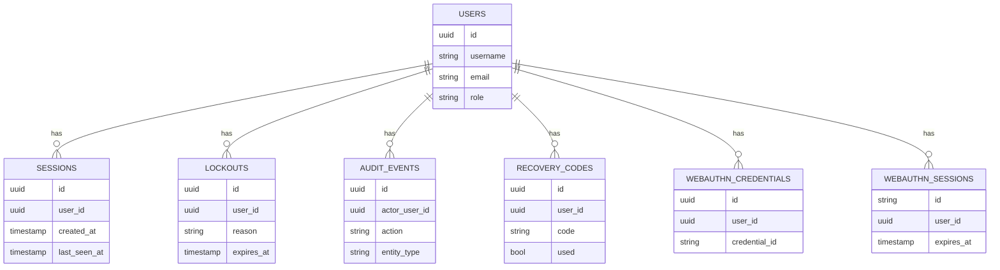

# Модель данных и хранилища

## Основные сущности (упрощенно)

```mermaid
erDiagram
  USERS ||--o{ SESSIONS : has
  USERS ||--o{ LOCKOUTS : has
  USERS ||--o{ AUDIT_EVENTS : has
  USERS ||--o{ RECOVERY_CODES : has
  USERS ||--o{ WEBAUTHN_CREDENTIALS : has
  USERS ||--o{ WEBAUTHN_SESSIONS : has

  USERS {
    uuid id
    string username
    string email
    string role
  }
  SESSIONS {
    uuid id
    uuid user_id
    timestamp created_at
    timestamp last_seen_at
  }
  LOCKOUTS {
    uuid id
    uuid user_id
    string reason
    timestamp expires_at
  }
  AUDIT_EVENTS {
    uuid id
    uuid actor_user_id
    string action
    string entity_type
  }
  RECOVERY_CODES {
    uuid id
    uuid user_id
    string code
    bool used
  }
  WEBAUTHN_CREDENTIALS {
    uuid id
    uuid user_id
    string credential_id
  }
  WEBAUTHN_SESSIONS {
    string id
    uuid user_id
    timestamp expires_at
  }
```

## Хранилища
- PostgreSQL: основное хранилище пользователей, сессий, аудита, WebAuthn.
- Redis: rate limit и временные счетчики.
