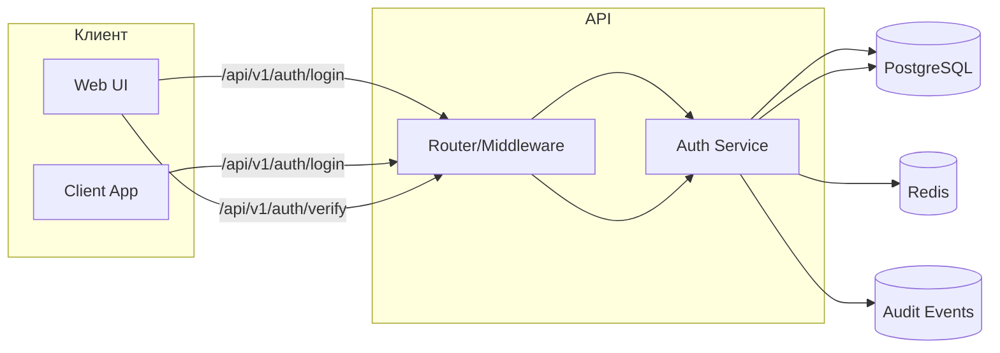
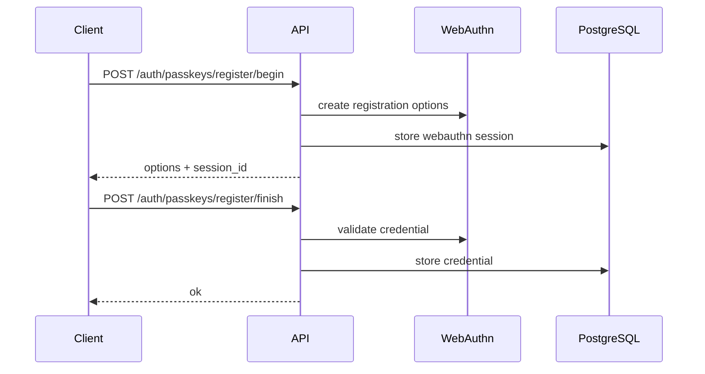
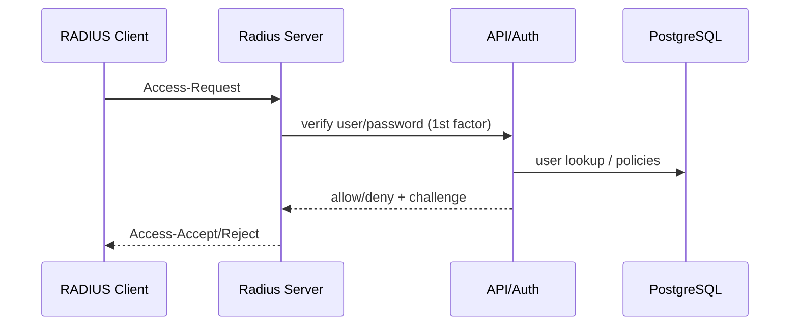

# Потоки

## Общий поток auth

```mermaid
flowchart LR
  subgraph Клиент
    UI[Web UI]
    App[Client App]
  end

  subgraph API
    Router[Router/Middleware]
    Auth[Auth Service]
  end

  DB[(PostgreSQL)]
  Redis[(Redis)]
  Audit[(Audit Events)]

  UI -->|/api/v1/auth/login| Router --> Auth
  App -->|/api/v1/auth/login| Router
  Auth --> DB
  Auth --> Redis
  Auth --> Audit

  UI -->|/api/v1/auth/verify| Router --> Auth
  Auth --> DB
```

## Поток passkey (WebAuthn)

```mermaid
sequenceDiagram
  participant C as Client
  participant A as API
  participant W as WebAuthn
  participant DB as PostgreSQL
  C->>A: POST /auth/passkeys/register/begin
  A->>W: create registration options
  A->>DB: store webauthn session
  A-->>C: options + session_id
  C->>A: POST /auth/passkeys/register/finish
  A->>W: validate credential
  A->>DB: store credential
  A-->>C: ok
```

## Поток RADIUS

```mermaid
sequenceDiagram
  participant R as RADIUS Client
  participant S as Radius Server
  participant A as API/Auth
  participant DB as PostgreSQL
  R->>S: Access-Request
  S->>A: verify user/password (1st factor)
  A->>DB: user lookup / policies
  A-->>S: allow/deny + challenge
  S-->>R: Access-Accept/Reject
```
