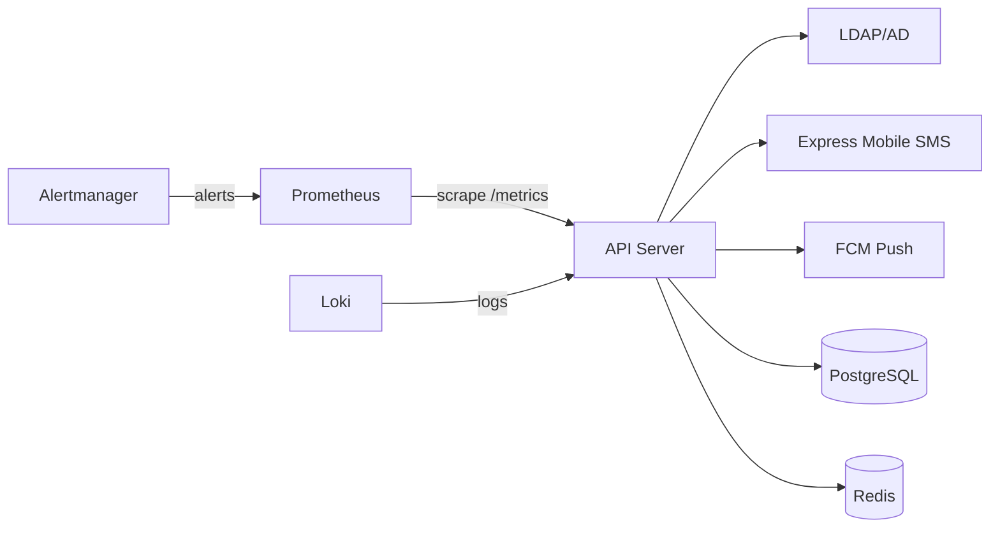

# Интеграции

```mermaid
flowchart LR
  API[API Server]
  LDAP[LDAP/AD]
  SMS[Express Mobile SMS]
  Push[FCM Push]
  PG[(PostgreSQL)]
  Redis[(Redis)]
  Prom[Prometheus]
  Loki[Loki]
  Alert[Alertmanager]

  API --> LDAP
  API --> SMS
  API --> Push
  API --> PG
  API --> Redis
  Prom -->|scrape /metrics| API
  Loki -->|logs| API
  Alert -->|alerts| Prom
```

## Внешние сервисы
- LDAP/AD — проверка первого фактора (если включено).
- Express Mobile — SMS/Call.
- FCM — push уведомления.
