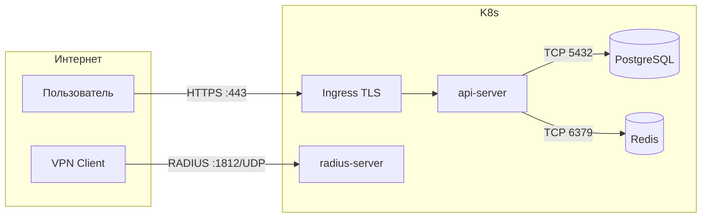

# Сетевая связанность

```mermaid
flowchart LR
  subgraph Интернет
    User[Пользователь]
    VPN[VPN Client]
  end

  subgraph K8s
    Ingress[Ingress TLS]
    API[api-server]
    RADIUS[radius-server]
    PG[(PostgreSQL)]
    Redis[(Redis)]
  end

  User -->|HTTPS :443| Ingress --> API
  VPN -->|RADIUS :1812/UDP| RADIUS
  API -->|TCP 5432| PG
  API -->|TCP 6379| Redis
```

## Порты
- API: 8080 (Service: 80)
- RADIUS: 1812/UDP
- PostgreSQL: 5432
- Redis: 6379
